# Information Security Review Note

> 期中考试在 12 月 30 日晚上举行，题型如下（往年）：
>
> ```python
> 判断题 * 5；多选题 * 5；问答题 * 若干
> ```
>
> 整体的复习思路较为简单，参考 text_book 和 ppt 进行双向复习，先顺一遍 text_book 完成中文笔记的书写，然后再根据 ppt 进行查缺补漏。最后通过公开的题目进行思考，将题目放在知识点中。
>
> 时间比较紧，一定要抓基础，抓基本知识点。

## 1. Security Principles

> 第一章常见题型就是识别各种 Security Principles，选择题比较多。

- **Know your threat model:** 明确知道攻击者的类型，并假设攻击者特别强大；

- **Consider Human Factors:** 考虑人的因素，如果东西不好用，就一定不会有人用，同时尽量不要让人参与过多内容；

  > The default setting for EvanBot Alpha was to store exam solutions with no encryption. To encrypt exam solutions with AES, TAs had to manually change a setting in EvanBot Alpha’s source code. The latest version of EvanBot encrypts exam solutions by default.

- **Security is economics:** 安全是需要代价的，不能一味地追求安全而忽视成本；

- **Detect if you can’t prevent:** 如果无法阻止问题的发生，至少要发现其已经发生了，并且及时地做出反应；

- **Defense in depth:** 多层次的防御，攻击者必须将所有层次都攻破才行；

- **Least privilege:** 做好权限管理，每一个独立的部分只能获取一定的权限，而不能影响全局；

  > When debugging students’ code, EvanBot Alpha ran all code with administrator privi- leges. The latest version of EvanBot runs untrusted code in an isolated environment (sandbox) instead.

- **Separation of responsibility:** 权利做好划分，可能需要多个人才能完成一个内容的许可，人多可以商量细节，保证安全；

  > Any TA by themselves could instruct EvanBot Alpha to release exam solutions. The latest version of EvanBot requires two TAs to approve the instruction before releasing exam solutions.

- **Ensure complete mediation:** 完成全链路检查，保证事无巨细；

- **Shannon’s Maxim — Don't rely on security through obscurity”:** 攻击者明确知道攻击对象的细节，不要信赖自己的算法；

  > To protect exam solutions, EvanBot Alpha used a secret encryption algorithm. The latest version of EvanBot uses a well-known encryption algorithm with a secret key.

- **Use fail-safe defaults:** 留一个后手，如果出现了不安全的情况，要有恰当的默认设置；

- **Design security in from the start:** 从刚开始就构造安全的系统；

  > EvanBot Alpha required frequent patches to fixx vulnerabilities. The latest version of EvanBot’s source code was rewritten from scratch and requires far fewer security patches.

**TCB**: The trusted computing base (TCB) is that portion of the system that must operate correctly in order for the security goals of the system to be assured. 不可越过、安全、可验证，需要十分简约，KISS 原则。


## 2. x86 Assembly and Call Stack

> 第二章常见的题目就是根据代码写栈的架构，需要牢牢地记住 11 个步骤，以及每一步下栈的变化。

#### Number representation

**word 的大小和系统位数相关**，32 位的系统 1 word = 32 bits，64 位的系统 1 word = 64 bits。

#### C Memory Layout

从小地址到大地址分为四个区域：

- **Code:** 存储可执行代码
- **Data/Static:** 存储数据，静态变量，全局变量
- **Heap:** 存储动态定义的数据
- **Stack:** 存储局部变量，以及其他和函数调用相关的变量

#### Little-endian words

x86 采用的是小端存储，数据低位存储在地址低位。

比如数字 `0x44332211` 存储在地址中，从小地址到大地址分别为 `11, 22, 33, 44`。

#### Register

除了 $2^{32}$ 个内存地址以外，x86 在 CPU 内部还有一些寄存器进行数据的存储。每一个寄存器都可以存储 32 位的数据（4 个字大小）。需要着重记一下如下的几个寄存器：

- `eip` (instruction pointer)，指令指针寄存器，存储的当前执行的机器码指令的地址；
- `ebp` (base pointer)，栈底寄存器，存储的是当前栈底的地址，每个函数都有自己新开辟的函数帧，需要仔细调整；
- `esp` (stack pointer)，栈顶寄存器，存储的是当前函数帧的栈顶地址，每次 push 地址都会向下找；

除了以上三个寄存器外，还有 6 个一般目的寄存器：`eax`, `ebx`, `ecx`, `edx`, `esi`, `edi`。

#### Stack: Pushing and Poping

#### x86 calling convention

`%eax` 表示 `eax` 寄存器中存储的数值，而不是数值对应内存地址中的值！也就是说一般在 `push` 和 `pop` 之前都很少和内存进行交互。

#### x86 function calls

总共是关于 `eip`，`esp` 和 `ebp` 三个寄存器的**共 11 步操作**，需要全部烂熟于心，并且需要熟练掌握 2.9 的这个例子。另外要十分注意第一次课程的题目。


## 3. Memory Safety Vulnerabilities

> 相关题目比较多，需要找时间集中刷一下题目

#### 3.1 Buffer overflow vulnerabilities

边界溢出是最常见的漏洞了，因为存在诸如 `fgets()` 等轻量级但不安全的函数，所以会出现很多 `buffer` 溢出的问题，导致内存被错误修改，造成结果出错。

#### 3.2 Stack smashing

通过在调用子函数时实现栈的构造，然后通过对栈进行溢出修改来进行破坏修改，进而执行目标程序段。这个地方有一个数据存储的点需要注意一下，那就是数组元素是从低地址往高地址走的。此处的一个核心注意点就是如何通过注入代码和代码地址进行恶意指令的执行，如果代码段过长就需要在 `rip` 上面再找空间，如果代码段长度刚好就可以在局部找空间。

如果存在 stack smashing，理论上可以修改所有的内容。

#### 3.3 Format string vulnerabilities

注意 `gets()` 和 `fgets()` 函数在 stack 中的变量不占存，只是实现了赋值。

```c
printf("x has the value %d, y has the value %d, z has the value %d \n", x, y)
```

这是这一部分主要讨论的问题，如果占位符占了 3 个位置，但是后面只有两个变量，就会导致输出 stack 中的已有部分，实现信息盗窃。

#### 3.4 Integer convertion vulnerabilities

常见的两个和整数转化相关的漏洞：

- 负数转化为无符号数时，会出现超大值的情况；
- 较大整数添加数的时候，出现整数溢出的情况，实际上只得到了一个很小的整数；

#### 3.5 Off-by-one vulnerabilities

存在一个保护机制使得可以往大小为 `n` 的数组中输入 `n+1` 个元素，也就是说允许一个 byte 的溢出。这种漏洞导致的核心问题是 `sfp` 值的改变，如果出现连续两次 return 就会导致程序执行错误。

#### 3.6 Other memory safety vulnerabilities

上述漏洞的核心问题是使得攻击者能够在有效的存储空间之外进行读或写。当然除了这些漏洞，还有一些其他的内存安全漏洞：

- **Use after free:** 内存空间已经被释放了，但是还在被使用
- **Heap overflow:** 堆溢出是 C++ 中常见的问题
- **Serialization vulnerabilities**: 让 Python，Java 等高级程序化语言中的序列化出现问题


## 4. Mitigating Memory-Safety Vulnerabilities

> 这一部分的题目也比较多，需要多加注意。而且相对来说更为实用

#### 4.1 Use a memory-safe language

Using a memory safe language is the **only way** to stop 100% of memory safety vulnerabilities. 尽管在理想情况下，如果所有人都用高级语言进行编程，内存安全漏洞应该不复存在，但事实上因为很多原因 C 还在被广泛使用，比如有很多“遗产”代码以及较高的性能。

#### 4.2 Writing memory-safe code

注意各种事项，书写内存安全的代码。核心是使用内存安全的相关工具包，就可以在安全的同时又没有那么乏味和负责。

#### 4.3 Building secure software

打造检验安全的软件，实现漏洞监管，可以使用多轮测试，进行软件的安全检查。具体来说有以下几种方法：

- Run-time checks
- Monitor code for run-time misbehavior
- Contain potential damage
- Bug-finding tools
- Code review
- Vulnerability scanning
- Penetration testing

#### 4.4 Exploit mitigations

很多时候，我们都无法直接通过完善代码来消除漏洞，只能通过进行一些 Code hardening defenses（代码加固防御）措施来进行缓解

**Non-executable pages**: 核心逻辑是让存储区中的部分内容是无法被执行的，就算被写入了代码，也仍然无法执行。考虑到目前 OS 中常用的页存储的方式，一个直接的方法就是让可以写的页不能被执行，让可以执行的页不能被写。这样的方法就可以使攻击失效；

- **Subverting non-executable pages: Return into libc**: 尽管锁定了很多页无法被执行，但是仍然可以通过修改 `rip` 选择性执行已有代码，通过在庞大的代码库中找到想要执行的目标进行攻击（修改 `rip` 的思路仍然是采用 `gets()` 等漏洞函数）。
- **Subverting non-executable pages: Return-oriented programming**: 已有的代码库可能不足以满足目标，可以通过不断地返回 `return` 来拼接不同区域的代码并执行，实现各种目标（拼接的核心方法是找到 `ret` 代码前的地址，然后注入到 `rip` 中）。

#### 4.8 Stack canaries

canaries 思路，通过多加一个 **canaries 位**来检测是否出现了内容注入。这个方法的思路在于如果攻击者想要通过改变 `rip` 来进行漏洞挖掘的话，那么只需要做一个 canaries 位挡在 `rip` 前面就可以保护它，或者提前发信号。

- 内容一般是一个 word 也就是 32 位长；
- 一般来说第一位是 `null`，以防止攻击者直接使用 `strcpy` 获得内容；
- 这个内容在每次程序运行的时候都是在变化的，以防止被试出来。

目前 C 语言在编译的过程中都有加入金丝雀位，这是一个简单高效的方法，没有理由不使用。

**Subverting stack canaries**

stack canaries 面临着如下一些基本的漏洞无法解决：

- 不可以检查栈外的修改；
- 无法阻止局部变量的修改；
- 有些漏洞（format string vulnerabilities）可以写入内存的非连续部分，那么就可以绕过 canaries 修改内容。

另外有一些方式可以猜出来 canaries 的值：

- Guess the canary 直接暴力求解的话，对于 32 位 canaries，其中共有 24 位随机值，是比较容易破解的；
- Leak the canary 如果遇到 print 等导致的 bug 容易造成 canary 值泄漏

#### 4.10 Pointer authentication

在 64 位机器中，其实地址的高位可能都没有用到，因此就可以编辑赋值一些其他的 secret number（PAC）作为原始值身份，如果后续这个 PAC 修改了，那么就说明有人注入了错误的内容，就识别出了错误。如果没有修改就去掉 PAC 得到原始值。

为了不存储 PAC 的原始值，可以构建一套和 Address 相关的函数标准，用以针对每一个 Address 都生成一个特定的 PAC，这样在生成和最后检查的时候就都可以进行比对了。

这套思路就很难被攻击了，因为攻击者必须要获得 PAC，要想获得 PAC 就必须要获得 secret 和映射关系，而这些只能在有 bug 的代码中破解出来，或者一个个试出来。

#### 4.11 Address Space Layout Randomization (ASLR)

ASLR causes the absolute addresses of variables, saved registers (sfp and rip), and code instructions to be different each time the program is run. 正是因为这种随机性的存在，地址注入攻击就不再能成功，因为每次地址都在变化，所以是琢磨不清的。

需要注意的是，这种方法下的随机性存在着一定的限制：比如只能从页的边界开始存储。

**Subverting ASLR**

其实此处和 PAC 以及 canaries 就很相似了，只有两个方法可以攻克 ASLR：

- Guess the address: 暴力求解
- Leak the address: 通过发现 bug 造成 address 泄漏

#### 4.13. Combining Mitigations

通过整合各种修复方法，来进行联合式的防御，可能更可靠，比如使用 ASLR 和 non-executable pages 进行保护的情况下，需要先找到地址，然后再构建 ROP 进行攻击，这几乎是不可能的。

#### 1.14 NOP Sleds

通过写入部分不执行操作的 NOP 代码，自动使得程序运行到目标 shell code。


## 5. Introduction to Cryptography

加密本质是信息传递者和攻击者之间的博弈。攻击者总是想获取传递者的信息并进行破译，而且因为信息会在非安全信道中进行传输，所以获取传递者的信息是非常容易的，因此如何在明知道攻击者能够获取这些信息的情况下，进行有效、安全的信息传递，这是加密的关键！

#### 5.1 Disclaimer: Don't try this at home !

因为所学的加密算法都是比较初级的，所以不要自己尝试，因为会出现各种漏洞。

#### 5.2 What is cryptography ?

- The study of secure communication over insecure channels
- Provide rigorous guarantees on the security of data and computation in the presence of an attacker

在引入 Alice、Bob、Eve 和 Mallory 之后，就可以对加密有更深的认识，就是说在 Alice 和 Bob 之间进行信息通信时，因为采用的是非安全通道，所以我们要保证：

- Eve 没办法在获取加密信息后破译出原始信息；
- Mallory 没办法在修改加密信息后不被发现

自然的，在整体过程中就要引入 key 的概念，加密者和解密者需要通过 key 对信息进行加密和解密，根据 key 的类型不同可以分为：

- symmetric key：对称的 key，也就是说 Alice 和 Bob 都知道一个相同的 key 的内容，用其进行信息传递。⚠️ 注意 key 一定是相同的。
- asymmetric key：非对称 key 加密，有 public key 和 secret key，基于这两个 key 进行信息传递。Alice 和 Bob 都会构建自己的 public key 和 secret key，同时 Alice 和 Bob 能够通过传递 public key 获取对方的 public key 内容，基于对方的 public key 进行加密后传递信息，然后对方使用自己的 secret key 进行解密。

#### 5.3 Three Goals of Cryptography

**Confidentiality**: An adversary cannot ***read*** our messages. 防止攻击者读取 private 数据，Alice 对信息进行加密后，尽管攻击者也可以看到加密后的信息，但是永远无法读取和破译出加密前的信息。实现 Confidentiality 的一种方法就是**加密**，一个形象的说明就是 Alice 用 Key 将信息锁在箱子里，攻击者能拿到箱子，但是永远看不到信息，只有 Bob 通过自己手中的 Key 才能实现解密破译。

**Integrity**: An adversary cannot ***change*** our messages without being detected. 只要信息被修改就一定会被发现。实现 Integrity 的最好方式就是添加 **seal** 或 **tag**：Alice 通过 key 盖 seal 或者加 tag，攻击者无法构建一样的 seal 或者 tag，因此就会被识别到信息修改了。

**Authenticity**: I can ***prove*** that this message came from the person who claims to have written it. 可以明确知道是谁写的这个信息。

后面两项实现的方法就在于盖信戳思维，Alice 和 Bob 都有规定的信戳，如果 Alice 写好信盖好信戳后，其他人想要破译就需要拆开的信戳并创造一样的信戳，才可以被识别到。

在这给出 Kerckhoff’s principle says:

- Cryptosystems should remain secure even when the attacker knows **all internal details** of the system.

- The key should be **the only thing** that must be kept secret.

- The system should be designed to make it **easy to change keys** that are leaked (or suspected to be leaked)

  > If your secrets are leaked, it is usually a lot easier to change the key than to replace every instance of the running software.

#### 5.4 Threat models

- ciphertext-only attack: 获得加密信息后还可以解密
- chosen-plaintext attact: 获得加密信息后，可以根据猜测 Alice 加密的过程进行破译，这一部分可以通过反复向 Alice 发送信息进行尝试
- chosen-ciphertext attack: 获得加密信息后，可以根据猜测 Bob 解密的过程进行破译，这一部分可以反复向 Bob 发送信息进行尝试
- chosen-plaintext/ciphertext: 上面两种情况的合集，既可以从 Alice 端尝试获取信息，又可以从 Bob 端尝试获取信息


## 6. Symmetric-Key Cryptography

开始学习对称加密，假设 Alice 和 Bob 双方共享一个 secret key，先不考虑双方如何进行 key 的通信的，假设双方目前都知道一个相同的 key 了。另外，我们需要注意的是后续操作的所有数据都是比特流形式。结构化的对称加密形式如下，后续本章所有内容都是针对其进行的延伸和探索：

- KeyGen() → *K*: Generate a key *K*
- Enc(*K*, *M*) → *C*: Encrypt a **plaintext** *M* using the key *K* to produce **ciphertext** *C*
- Dec(*K*, *C*) → *M*: Decrypt a ciphertext *C* using the key *K*

#### 6.1 IND-CPA Security

之前定义的 Confidentiality 的含义并不准确，如果攻击者可以获取其中的一个字，还算不算？因此，在这给出更为精确的定义: The ciphertext *C* should give the attacker no additional information about the message *M*. In other words, the attacker should not learn any new information about *M* beyond what they already knew before seeing *C* (seeing *C* should not give the attacker any new information). 更进一步的还可以通过实验进行定义，Alice 发出的两条信息，Eve 只有 50% 的概率能够正确匹配。

就得到了 IND-CPA 的定义：Even if Eve can trick Alice into encrypting some messages, she still cannot distinguish whether Alice sent $M_0$ or $M_1$ in the experiment. This definition is known as **indistinguishability under chosen plaintext attack**, or IND-CPA. 简单来说就是在 chosen-plaintext 下的不断攻防，如果 Eve 有大于 50% 的概率得到结果，那么就说明不是 IND-CPA。

- 攻防所用到的 $M_0$ 和 $M_1$ 都是相同长度的（从实际上来说，长度会自动补齐，因此就算采用不同长度的输入也是没意义的）；
- Eve 的攻击次数是有限的，理论上来说存在穷举的暴力解法，但是受限于时间以及其他的次数限制是实际上不可行的；
- Eve 的获胜概率不能是可忽略的，如果概率是 $1/2 + 1/2^{128}$ 尽管也大于 $1/2$ 在理论上可行，但是实际上无法操作。那如何判断是否是可忽略的呢？需要选择一个阈值！目前 $2^{80}$ 是一个合理的选择，但是也会一直变化。

#### 6.2 XOR review

异或操作十分十分重要，是后续进行**加密的核心操作**：
$$
(x \oplus y) \oplus z = x \oplus(y \oplus z)
$$
有一个十分重要的公式必须谨记并且会用：
$$
x\oplus y \oplus y = x
$$

#### 6.3 One Time Pad (1 symmetric encryption)

算法思路很简单，就是单纯用抑或操作即可，加密和解密的操作都是一样的。

- Key generation: Alice and Bob pick a shared **random** key $K$.
- Encryption algorithm: $C= M \oplus K$.
- Decryption algorithm: $M= C \oplus K$.

这个算法的核心点在于 $K$ 的每次随机性，如果能够保证每次随机，那么就是 IND-CPA。如果  $K$ 被重复使用，那么就不再是 IND-CPA 的了，这也就是叫做 One Time Pad 的核心原因，只能用一次，再次使用的时候必须重新随机初始化。如果反复使用那么 IND-CPA 的游戏中，获胜的概率是 100%。这也就是说，每次二者都要重新约定 key，而且 key 需要有很强的随机性，所以其存在两个大的问题：

**Problem #1: Key generation**

- For security to hold, keys must be randomly generated for every message, and never reused;
- Randomness is expensive, as we’ll see later.

**Problem #2: Key distribution**

- To communicate an *n*-bit message, we need to securely communicate an *n*-bit key first;
- But if we have a way to securely communicate an *n*-bit key, we could have communicated the message directly!

#### 6.4 Block Ciphers (2 symmetric encryption)

每次重新约定 key 并进行传输是完全不可取的，因此需要一种方式只用固定的 key。这时就引入了 Block Ciphers 这种方式，就是搭建了一个固定的计算模块使用固定的 key 来进行加密和解密，这个计算过程实质上搭建了一个单映射关系。两个常见的 block cipher 方法：1) Data Encryption Standard (DES); 2) Advanced Encryption Standard (AES)。

但是我们可以发现，这种单一映射关系其实并不能保证 IND-CPA，因为只要测试一次结果就出来了。因此这个地方需要搭建一个随机的映射关系。【这一部分郑老师 PPT 上没出现，就算了】

AES 的方程足够复杂，且对于不同长度的 key，有着不同的加密 round：长度越长，加密 round 数就越多。并且每一个 round 下的操作方式有很多种。

Block ciphers are not IND-CPA secure, because they’re deterministic

- A scheme is **deterministic** if the same input always produces the same output
- No deterministic scheme can be IND-CPA secure because the adversary can always tell if the same message was encrypted twice

Block ciphers can only encrypt messages of a fixed size

- For example, AES can only encrypt-decrypt 128-bit messages 如果超过 128 位，只能切分开，然后进行分别加密了

#### 6.5 Block Cipher Modes of Operation

通过聚焦 AES 的两个问题：

- The first is that we’d like to encrypt arbitrarily long messages, but the block cipher only takes **fixed-length** inputs.
- The other is that if the same message is sent twice, the ciphertext in the two transmissions **is the same with AES** (i.e. it is **deterministic**).

所以后续的解决方法多从以下两个角度入手 1) 算法具有随机性；2) 算法依赖于一些状态信息。

注意每种不同模式下的：安全性、并行性以及是否需要 pad 三大关键问题。

**AES-ECB (The Electronic Code Book Mode of AES)**

简单直接的思路，针对第一个问题，将长信息进行顺序切分后然后逐个进行加密，最后聚合起来，然后再分别解密。最后一个如果不足就补足，并记录有效位数。

这种加密方法明显存在问题，那就是位置信息完全暴露（因为每一部分的加密的相对性还是存在的），例子就是**企鹅图片的相对纹理关系**被显示出来，所以 ECB 不是 IND-CPA 的，因为位置信息泄露十分明显。加密和解密方式完全对称，在此只给出加密图。

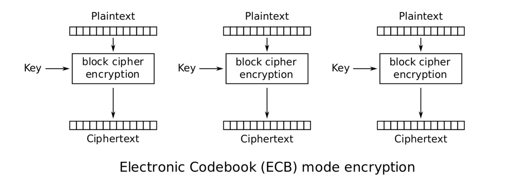

**AES-CBC (The Cipher Block Chaining Mode of AES)**

在 ECB 的基础上进行随机性改进，通过引入随机的输入来进行改进。失去相对位置信息。

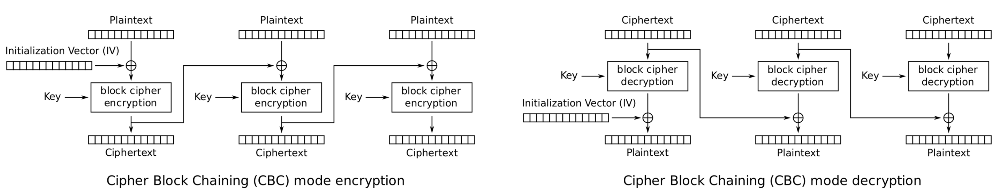

CBC 的加密过程是不能并行的，CBC 的解密过程是可以并行的。

在此再强调一次 Pad，因为密码长度完全可能不是 n 倍的 block 长度，所以需要进行 Padding。需要在解 Pad 的时候没有异议，就需要一定的 trick。比如最后将需要填充的位填上缺少的位数。而不是填充 0 或者 1。但是这样的填充也有很大的概率出现问题？

当 IV 不被重复使用，并且一定是随机生成的，**那么 AES-CBC 就是 IND-CPA 的**。

**AES-CTR (The Counter Mode of AES)**

和 CBC 一脉相承，只不过初始化的随机数不再一样，改成了随机初始化加上一个计数器值。在这个地方的 nonce 和 IV 是一个含义，nonce 的全称是 number used once.

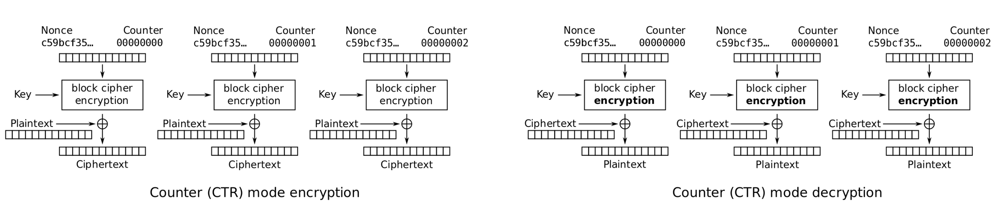

CBC 的加密过程和解密过程都是可以并行的，而且不需要考虑 Pad，因为只需要将最后长的部分给剪掉即可，**CTR mode 是 IND-CPA 的**要求还是和之前一样 nonce 不能重复使用，必须要保证随机初始化。CTR 的安全性较比 CBC 要差一些。

**Reusing IVs is insecure**

明确知道 CBC 和 CTR 都是 IND-CPA 的，但是前提是 IVs 不能被重复使用。

**AES-CFB (Ciphertext Feedback Mode)**

是 CBC 和 CTR 的中间形式，安全性比 CBC 差，但是比 CTR 好，加密不并行，解密并行。

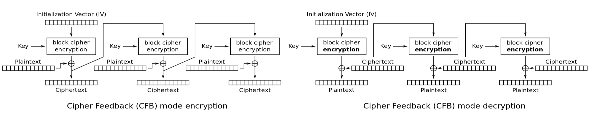


## 7. Cryptographic Hashes

这一个部分没有涉及到加密的主线，相当于一个支线介绍了 Hash 函数在加密中的应用。

#### 7.1 Overview

一个可以针对很大信息，构建固定长度 fingerprint 的方式。有一个特征：不管多小的原始变化都会造成很大结果变动。如果原始信息相同那么 hash 得到的信息一定相同，反之一定不同。反过来，如果 hash 得到的信息一定相同，那么原始信息也一定相同，反之不同。

#### 7.2 Properties of Hash Functions

- **One-way**: 单向计算，只能通过 hash 得到 y，不能通过 y 反推 x
- **Second preimage resistant**: 很难找到重复项
- **Collision resistant**: 冲突解决机制。

#### 7.3 Hash Algorithms

Hash 函数节节更新，大体可以分为以下几个阶段：

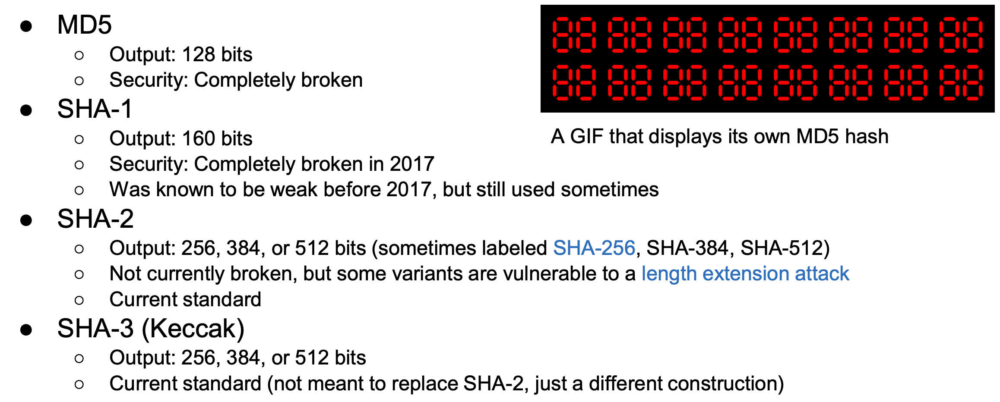

Hash 凭借其识别信息是否相同的特性可以被用于设计 integrity 的方式。那 Hash 是否一定能够实现 integrity 呢？不一定，因为如果 hash 值可以被修改那么攻击者就可以同时修改 hash 值和原信息值，实现修改后但不被发现（因为 Hash Funciton 是固定的，很容易就能求解）  


## 8. Message Authentication Codes (MACs)

#### 8.1. Integrity and Authenticity

motivation 很简单，回到了主线，开始进行对称的 Integrity and Authenticity 的算法学习。因为害怕信息被修改，所以必须要构造算法进行检验保护。在这个地方直接引入了 message authentication codes 的方式。不仅想要安全地传递信息，还想要准确地附上传递信息人的标签。

#### 8.2 MAC: Definition

The MAC on a message $M$ is a value $F (K, M)$ computed from $K$ and $M$; the value $F (K, M )$ is called the tag for **M** or the **MAC** of $M$ . Typically, we might use a 128-bit key **K** and 128-bit tags. 也就是说不仅将 message 进行加密，还根据算法使用 key 和 message 构建了一个 Tag，通过这个 Tag 就可以确定发信人信息。当 Bob 收到信息后也用同样的算法根据 key 和 message 计算，如果能和 Tag 对上，就说明信息正确，如果对不上就说明有问题。

这个思路不仅可以用在传递信息上，还可以用在其他任何需要文件保护的场景，都可以打上标签。

#### 8.3 MAC: Security Properties (EU-CPA)

首先，算法需要保证正确性，只要 $M$ 被修改了，就能够及时发现。另外，很难找到漏洞，猜出来正确的值

A secure MAC is **existentially unforgeable**: without the key, an attacker cannot create a valid tag on a message

- Mallory cannot generate MAC(*K*, *M'*) without *K*
- Mallory cannot find any *M'* ≠ *M* such that MAC(*K*, *M'*) = MAC(*K*, *M*)

如果用类似于 IND-CPA 的定义方法的话，不管攻击者发送并收到多少的 (M, T) 对，他永远也预测不出来真对下一个 M 的 T。

#### 8.4 Some Examples of MAC

**NMAC**

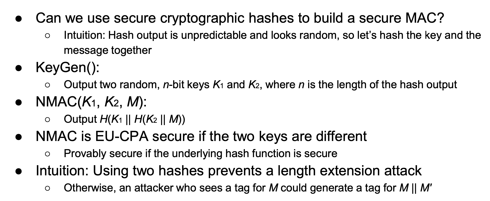

**HMAC**

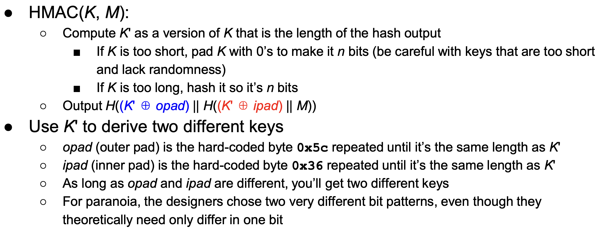

这个地方的 $K^\prime$ 就是 $K$ 变化后的结果，可能是 $K$ 不够长而补 0 的结果，也可能是 $K$ 过长而 Hash 后的结果。opad 和 ipad 就是数字的重复。

#### 8.6 MACs are not confidential

根据上面的分析，可以得到 MACs provide integrity，可以防止信息被修改；但是 MACs provide authenticity 的结论需要根据 Threat Model 来判断，如果只有两个人，那答案肯定是可以的，如果有多个人还需要更多的身份识别戳。但是明显这一步加 tag 的操作并没有编码，没有对 M 做任何操作，因此在传输的过程中是明文，不会 confidential，在传输的时候可能会泄漏信息。同时 MAC 的传输也缺乏安全性。

#### 8.7 Authenticated Encryption

A scheme that simultaneously guarantees confidentiality and integrity on a message. Symmetric-key authenticated encryption modes usually combine a block cipher mode (to guarantee confidentiality) and a MAC (to guarantee integrity and authenticity).

整合加密和 MAC 两种算法，从而实现加密和盖戳两种目的，思路有以下两种：

- **encrypt-then-MAC approach**: 先对信息进行加密然后再进行 MAC
- **MAC-then-encrypt approach**: 先对信息进行 MAC 然后再进行加密

这两种思路的结果都是能保证信息（plain-text）传递是 IND-CPA 和 EU-CPA 的，但是先加密后 MAC 的效果好在可以直接检测出信息有没有被修改，而先 MAC 后加密的方法则只有解密之后才能发现信息是否被修改。加密和进行 MAC 生成时的 key 是不一样的，因此会用到两个 Key。

不要 reuse the same key multiple times for the same use.

#### 8.8 AEAD Encryption Modes

**Authenticated encryption with additional data** (**AEAD**): An algorithm that provides both confidentiality and integrity over the plaintext and integrity over additional data.

additional data 的含义是指不仅使用加密的部分，而且使用一些其他非加密的数据。但是如果没有合理使用的话，容易导致 confidentility 和 integrity 的损失。

**AEAD Example: Galois Counter Mode (GCM)**

是一种特殊的算法，类似于 CTR 的加密方式，比较复杂。128 位的操作，速度比较快，IV 坚决不能重复使用，GCM 是有三个性质的，但是如果用错可能比 CTR 还要差。


## 9. Pseudorandom Number Generators

#### 9.1 Randomness and entropy

随机是一个很重要的但很难真正达到的概念，在实际中用到的随机数大都是伪随机数。但是伪随机数在理论上可以打造和随机数相同的结果。构造真随机数的过程是很昂贵的，要构建无偏的往往需要在多个现实集合，因此往往常常使用伪随机数。

#### 9.2. Pseudorandom Number Generators (pRNGs)

输入少量真正的随机数输出长的随机数。pRNG 算法其实是固定的，因此同样的种子出来的随机数是固定的。但是对于不知道种子的攻击者来说，输出就是完全无法识别的。

一般来说 pRNG 是根据一下三个函数进行操作的：

- Seed(entropy): Take in some initial truly random entropy and initialize the pRNG’s internal state.
- Reseed(entropy): Take in some additional truly random entropy, updating the pRNG’s internal state as needed.
- Generate(n): Generate n pseudorandom bits, updating the internal state as needed. Some pRNGs also support adding additional entropy directly during this step.

#### 9.3. Rollback resistance

攻击者无法识别到之前产生的随机数，只能知道当前的状态，无法根据过去的内容推断后续内容。

#### 9.4 HMAC-DRBG

很多生成 pRNGs 的方法，其中比较常用的就是 HMAC-DRBG，HMAC-DRBG maintains two values as part of its internal state, K and V. K is used as the secret key to the HMAC, and V is used as the “message” input to the HMAC. 通过反复循环来构造指定位数的随机数。这部分的算法主要有 3 种。

#### 9.5 Stream Ciphers

A symmetric encryption algorithm that uses pseudorandom bits as the key to a one-time pad. 和 Block Cipher 不同的是，不再是切分内容，而是一个 bit 一个 bit 的进行流式加密和解密。通过 IV 设定初始状态，因为加密和解密的初始状态相同，所以产生的随机数也相同，而且 IV 每次都不同所以每次产生的都不一样。这样就可以达到不用传递 k，但是 k 随机生成的目标了。

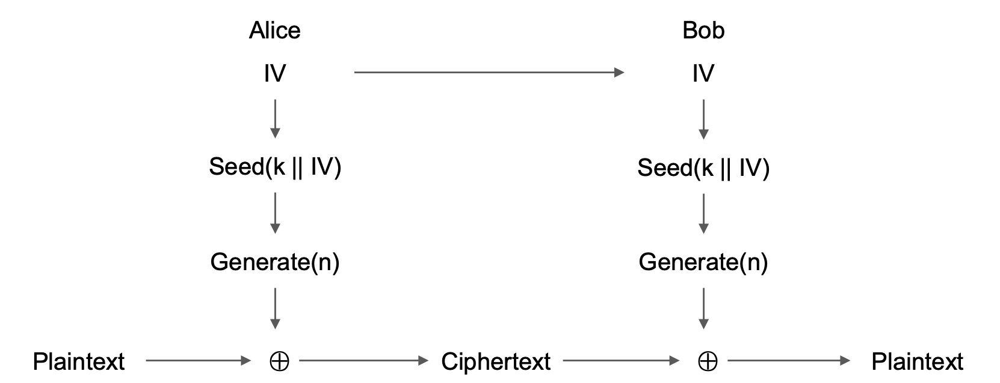

事实上，AES-CTR 是一种很有效的 stream cipher，如果将 nonce 看作伪随机数的话，就可以得到这样的结果。

在安全和效率上进行说明：

- 安全上：Stream ciphers are IND-CPA secure, assuming the pseudorandom output is secure. In some stream ciphers, security is compromised if too much plaintext is encrypted. （用多了就会重复）

- 效率上：只要来新的元素就可以源源不断地加密，可以进行任意位置的解密。


## 10. Diffie-Hellman Key Exchange

这一章同样是支线，但是讲得却是十分重要的支线内容 —— 如何在 insecure 的信道中交换 key。之前讨论了那么多要换信息的场景，总是说先不管 key 是如何交换的，但这就是我们切实面临的问题！

#### 10.2. Discrete logarithm problem

DH 算法的核心是建立在 Discrete logarithm problem 上，在此使用的是 mod 函数：知道 $x$ 求 $f(x) = g^x \mod z = y$  很简单，但是反过来知道 $y$ 求 $x$ 则是很难的事情。

#### 10.3. Diffie-Hellman protocol

$p$ is a large prime and $g$ is a generator in the range $1 < g < p−1$. $p$ 的位数越高，反向解决的复杂度就越高，因此一般选到了 2048 位。后续的计算就极为**简单明了**：

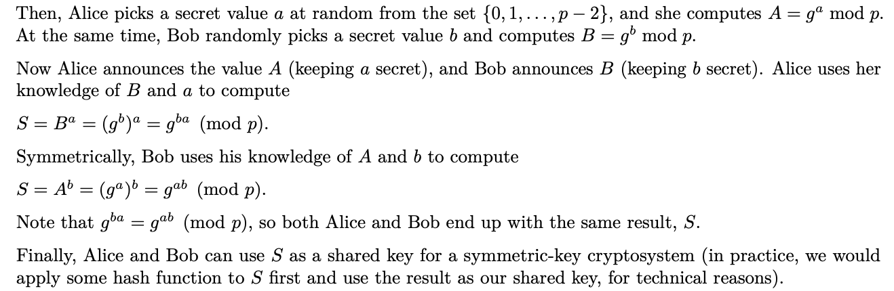

令人惊叹的是，全部都是公开发送，但是却能实现交换密钥的作用。如果中间人试图通过 $A$ 和 $B$ 求解 $S$ 的话，作为一个 discrete logarithm 问题，这是十分难计算的。

#### 10.4. Elliptic-curve Diffie-Hellman

基础的 DH 算法是基于求模算法得到的，这个算法虽然已经是 discrete logarithm 的，但是复杂度还可以再高一些，在此引入了 Elliptic-cure 方法。该方法更难被破解，因此可以用更小的 key 了。

#### 10.6. Attacks on Diffie-Hellman

DH 算法很容易受到攻击，核心的一种形式是：man-in-the-middle (MITM)，简单来说就是在 Alice 和 Bob 之间多了一个人进行 key 拦截，但是二者都发现不了，都还以为是对方。拦截的人已经将 key 全部都获取到了。这本质是因为 Diffie-Hellman does not provide *authentication*.

除了上面的大问题以外，还有 DHE is an *active protocol*，也就是说 Alice 和 Bob 两个人必须同时在线上才能传递 key，如果有一个人不在线，就没办法传递 key，也就没办法传递信息了。


## 11. Public-Key Encryption

回归主线，看一下非对称加密算法。之前的对称加密算法中要求 Alice 和 Bob 必须共享一个 Key 并用其进行加密和解密。这种方法明显需要持续沟通 key，很不方便，因此引入非对称加密算法是一个好的解决方式。思想上来说，这是一个再简单不过的问题了，无非就是 Alice 和 Bob 双方都需要构建 public 和 private key，public key 是所有人可见的。因此想跟谁发信息，就直接用对方的 public key 进行加密，对方收到后用自己的 private key 进行解密。

更加方便，但是不同于对称算法，计算方式比较复杂，耗时较多。

#### 11.2. Trapdoor One-way Functions

之前我们看过很多的 one-way functions，现在要引入的是 Trapdoor one-way function，在之前反向推比较难的基础上加一个条件，就是如果知道相关的对应信息就可以很容易地实现反推。这样的方程的存在是实现公开密钥加密算法的核心所在。

#### 11.3 RSA Encryption

> RSA 同样是三个科学家的名字：Rivest, Shamir, Adleman

算法过程并不复杂，关键在于根据 $d$ 求解 $e$，以及后续的计算正确。

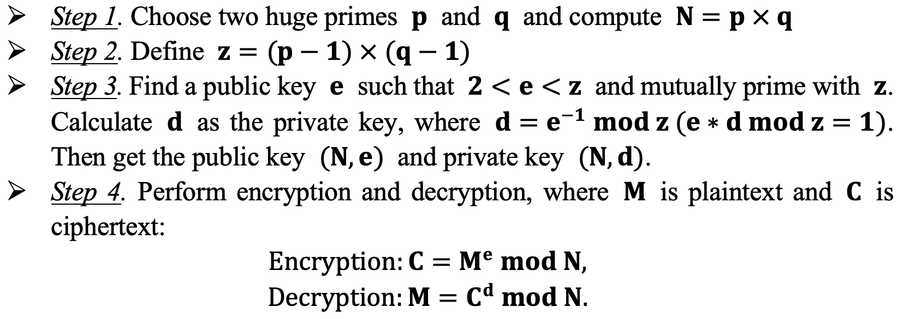

因为 RSA 的 key 是固定的，因此无法做到 IND-CPA，就需要引入一定的随机性来解决这个问题。因此就有了 padding 的做法，OAEP (Optimal Asymmetric Encryption Padding) 是其中一种方式。但是这儿的 padding 并不只是简单加位数，更是进行随机性注入。

#### 11.4 El Gamal Encryption

机关 Diffie-Hellman 让 Alice 和 Bob 共享了 key 同时可以基于这个 key 进行对称加密，但是似乎还无法直接传递信息，只能传递和 key 相关的内容。所以在这引入了 EI Gamal Encryption 方法，进行进一步探索。这一部分的加密过程由于加上了 M 中的内容，所以会有一些复杂。在上考场前需要再记一下。

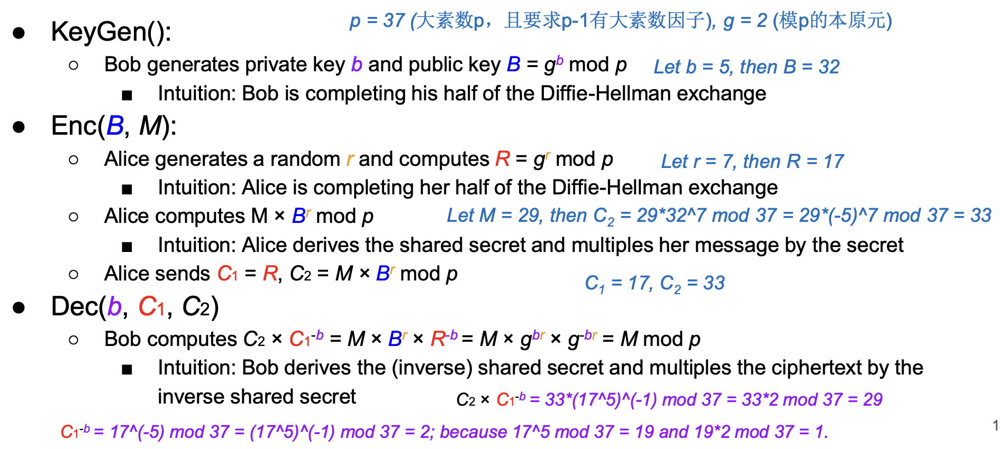


## 12. Digital Signatures

上述的内容保证了进行非对称加密时的正确性，此处提到的 digital signatures 则更加注重 integrity and authentication. 整体的逻辑也很简单：希望只接收那些信息没有被修改过的内容，所以就必须要加一个签名在上面进行身份验证。

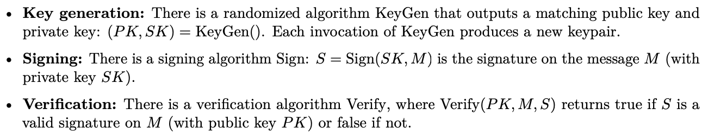

#### 12.4 RSA Signatures

和 RSA 最后的加密和解密的步骤基本一致，只不过生成 signature 时用的是私钥而不是公钥，检查签名有没有被修改的时候用的是公钥而不是私钥。

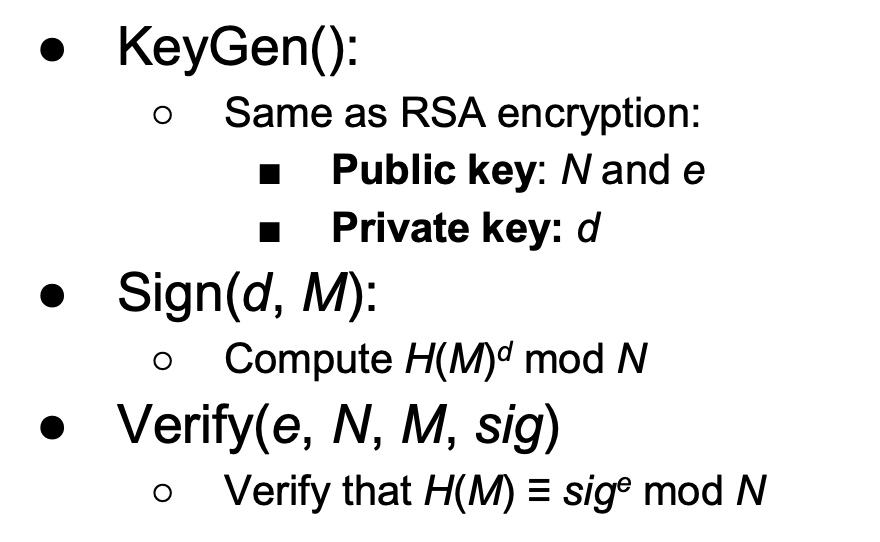

